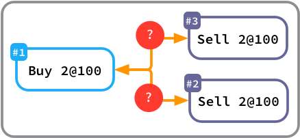

# Order Book Demo

I stumbled upon a Reddit post today on r/quant asking for C++ project ideas. 
The top comment suggested writing an 
<a href="https://www.reddit.com/r/quant/comments/g5bi9k/looking_for_c_project_ideas/fo3am1j?utm_source=share&utm_medium=web2x" >
order matching engine</a>, and since I was both interested in a future career in quant and 
sharpening my C++ experience, I set out to do just that.

After a couple of minutes of research, I found a <a href="https://www.youtube.com/watch?v=fxN4xEZvrxI">
perfect tutorial </a> and followed it meticulously. The code for this project can be found
in `src/` and tests can be found under `test/`, written with 
<a href="https://github.com/google/googletest">Google's C++ Testing Framework</a>.

After doing this, I learned more about how to write CMake lists, override operators, 
the friend/inline modifiers, defining custom types, differences between older and newer
language versions, using iterators, and using lambdas in C++. It really reinforced 
material I learned in my college classes!

## How to Use It
If you don't have it already, make sure you install the Cling C++ interpreter
(which is `brew install cling` on a Mac). To interact with the order book, 
navigate to `src/` and do `cling --nologo -std=c++1z` to start Cling. Once that's going,
use `.L OrderBook.cpp` to load in the class definitions, and you are good to go!